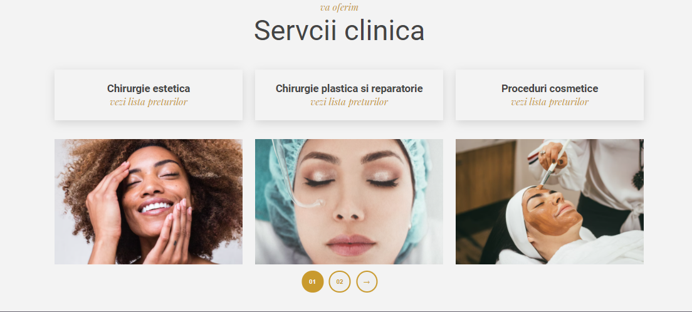

# __Aesthetic _Gold_ Surgery Center__

## Overview
<p>This website is an aesthetic surgery center where people are able to see details about the clinic and make an appointment with the doctor</p>

---

## JavaScript carousel

 

```JavaScript
// slider
let currentSlide = 0;
const maxSlide = slider.length;

const goToSlide = function (se, px) {
  slider.forEach((s, i) => {
    s.style.transform = `translateX(${px * (i - se)}%)`;
  });
};
const btnTwoActive = function () {
  btnTwo.classList.add("slider__active");
  btnOne.classList.remove("slider__active");
};
const btnOneActive = function () {
  btnTwo.classList.remove("slider__active");
  btnOne.classList.add("slider__active");
};
const inToView = function (e) {
  e.classList.remove("hidden");
};
//next slide
const nextSlide = function () {
  if (currentSlide === maxSlide - 1) {
    currentSlide = 0;
    btnOneActive();
  } else {
    currentSlide++;
    btnTwoActive();
  }

  goToSlide(currentSlide, 130);
};

const prevSlide = function () {
  if (currentSlide === 0) {
    currentSlide = maxSlide - 1;
  } else {
    currentSlide--;
    btnOneActive();
  }

  goToSlide(currentSlide, 130);
};

const init = function () {
  goToSlide(0, 130);
};
init();

sliderBtn.addEventListener("click", nextSlide);
btnTwo.addEventListener("click", nextSlide);
btnOne.addEventListener("click", prevSlide);


```

## JavaScript second carousel

 

```JavaScript

// carousel
let l = 0;
const right_mover = () => {
  l++;
  for (const i of personalElement) {
    if (l == 0) {
      i.style.left = "0rem";
    }
    if (l == 1) {
      i.style.left = "-15.5rem";
    }
    if (l == 2) {
      i.style.left = "-37rem";
    }
    if (l > 3) {
      l = 3;
    }
  }
};
const left_mover = () => {
  l--;
  for (const i of personalElement) {
    if (l == 0) {
      i.style.left = "0rem";
    }
    if (l == 1) {
      i.style.left = "-14.5rem";
    }
    if (l == 2) {
      i.style.left = "-21rem";
    }
    if (l < 0) {
      l = 0;
    }
  }
};

btnRight.addEventListener("click", right_mover);
btnLeft.addEventListener("click", left_mover);
```